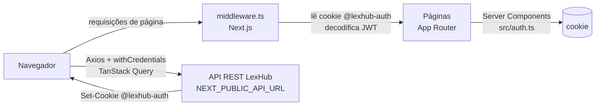

# Arquitetura

> Estado do sistema em 11/09/2026 (último commit `84f639f`). Este repositório
> contém **apenas o frontend**; o backend é uma API REST separada.

## Visão geral



- **Renderização**: páginas (`page.tsx`) e layouts são Server Components;
  toda interação com dados acontece em Client Components (`'use client'`) via
  TanStack Query chamando a API diretamente do navegador.
- **Não há rotas de API/Server Actions no Next** — o Next serve só a UI e o
  middleware.

## Stack

| Camada | Tecnologia |
| --- | --- |
| Framework | Next.js 15.5.25 (App Router, `next dev --turbopack`; última da linha 15 — o Next 16 troca `middleware.ts` por `proxy.ts`) |
| UI | React 19, Tailwind CSS v4, shadcn/ui (new-york) + `radix-ui`, `vaul` (Drawer), lucide-react, framer-motion |
| Tema | `next-themes` (claro / escuro / sistema), tokens da identidade visual da OAB |
| Dados | TanStack Query v5, Axios |
| Formulários | react-hook-form + zod (`@hookform/resolvers`) |
| Datas / gráficos | date-fns (locale `ptBR`), recharts |
| Feedback | sonner (toasts que seguem o tema, `richColors`) |
| Auth | `jwt-decode` (apenas decodificação, sem verificação de assinatura) |
| Qualidade | TypeScript strict, Biome 1.9 (lint + format) |
| Pacotes | pnpm |

## Estrutura de pastas

```
src/
├── api/                     # 1 arquivo = 1 endpoint (ver docs/api.md)
│   ├── agents/              # sessão, perfil, CRUD de funcionários, senha
│   ├── dashboard/           # métricas agregadas
│   ├── services/            # atendimentos
│   └── services-types/      # tipos de serviço
├── app/
│   ├── layout.tsx           # <html lang="pt-BR">, fontes Barlow/Montserrat, ClientProvider, Toaster
│   ├── not-found.tsx        # 404
│   ├── globals.css          # tokens de tema (claro/escuro) e de marca, animação slide-up
│   ├── (public)/(auth)/     # painel institucional (≥ lg) + formulário, seletor de tema
│   │   ├── (sign-in)/       # "/"  → login
│   │   ├── forgot-password/
│   │   ├── confirm-send-email/
│   │   └── reset-password/
│   └── (private)/(app)/     # SidebarProvider + AppSidebar + SidebarInset
│       ├── layout.tsx       # checa ADMIN e lê o cookie sidebar_state (server)
│       ├── dashboard/
│       ├── services/        # Central de Atendimentos
│       ├── services-types/  # Controle de Serviços (ADMIN)
│       └── agents/          # Gestão de Funcionários (ADMIN)
├── components/
│   ├── app/                 # componentes próprios reutilizáveis
│   │   ├── brand/           # BrandLogo, BrandWave, OabOutline
│   │   ├── shell/           # AppSidebar, AppHeader, NavUser, LogoutDialog, nav-config
│   │   ├── page-header.tsx  # título + descrição + ações de cada página
│   │   ├── table-empty-state.tsx, filter-input.tsx, pagination.tsx
│   │   ├── *-badge.tsx      # ServiceStatusBadge, AssistanceBadge, RoleBadge
│   │   └── theme-toggle.tsx # seletor Claro/Escuro/Sistema
│   └── ui/                  # shadcn/ui (gerados — evitar editar à mão)
├── hooks/use-mobile.ts      # breakpoint de celular (768px) usado pela sidebar
├── env/index.ts             # validação das variáveis com zod
├── lib/                     # axios, react-query, cn()
├── utils/                   # calculate-duration-service, format-full-name, calculate-variation, calculate-share, download-file
├── auth.ts                  # checkAdminStatus(), getIsAgentAuthenticated()
└── middleware.ts            # controle de acesso por rota
```

Convenção: cada rota privada tem `page.tsx` (Server Component, define
`metadata.title` no formato `"<Página> | OAB Atende"`) e uma pasta
`components/` com os Client Components daquela tela.

## Autenticação e sessão

1. Login envia `POST /agents/sessions` com `withCredentials: true`.
2. O **backend** grava o cookie httpOnly `@lexhub-auth` (JWT). O `token` que
   vem no corpo da resposta é ignorado pelo frontend.
3. Payload do JWT usado pelo frontend: `sub` (id do funcionário), `role`
   (`ADMIN` | `MEMBER`), `exp`.
4. `src/middleware.ts` roda em toda requisição de página. Sessão válida é
   um cookie com JWT decodificável e `exp` no futuro. A assinatura não é
   verificada. O middleware:
   - com sessão inválida (cookie malformado, sem `exp` ou expirado), apaga
     o cookie. Em rota privada, redireciona para `/`; em rota pública, a
     página abre normalmente. Nunca redireciona `/` para `/`;
   - redireciona visitante sem cookie para `/` (rotas privadas);
   - redireciona usuário logado para `/dashboard` (rotas públicas);
   - redireciona `MEMBER` para `/dashboard` em `/agents`,
     `/services-types` e nas subrotas delas (casamento por prefixo);
   - **não** grava nem renova o cookie. Quem grava e apaga é só a API.
     Para apagar, o middleware usa o mesmo `domain` (`NEXT_PUBLIC_DOMAIN`)
     e `path` (`/`) da API, e apaga também a variante sem `domain`, de
     versões antigas.
5. Server Components usam `src/auth.ts`:
   - `checkAdminStatus()` → `true` se `role === 'ADMIN'` (controla o menu e
     permissões na listagem de atendimentos);
   - `getIsAgentAuthenticated()` → `sub` do token (usado para saber quais
     atendimentos são do usuário e para o card do dashboard);
   - as duas retornam `false` se o cookie não puder ser decodificado.
6. Logout: `POST /agents/logout` (o backend limpa o cookie),
   `queryClient.clear()`, `router.replace('/?logout=true')` e, **depois**,
   `router.refresh()`. Se a chamada falhar (ex.: 401 com o token já
   expirado), o usuário sai do mesmo jeito, sem toast de erro. Se o perfil
   não carregar (ex.: funcionário inativado), a sidebar mostra um botão
   "Sair" no lugar do menu do usuário.
7. Login bem-sucedido também chama `queryClient.clear()` e, depois do
   `router.replace('/dashboard')`, `router.refresh()`, para não mostrar
   dados nem o menu de outro usuário da mesma aba. O `refresh` precisa vir
   depois: o roteador do Next descarta um `refresh` pendente quando chega
   uma navegação. Sem ele, o `replace` reaproveita a árvore de
   `/dashboard` pré-carregada na sessão anterior.

> Ainda **não** há interceptor global de 401. Hoje a API responde 401
> também a erros de negócio, e o interceptor deslogaria o usuário à toa.
> Ver o item 15 de [tech-debt.md](./tech-debt.md).

> ⚠️ Toda checagem de papel no frontend é **cosmética** — o JWT é apenas
> decodificado, não verificado. A autorização real precisa estar no backend.

Matriz de rotas → ver [domain.md](./domain.md#permissões).

## Estado e cache (TanStack Query)

`QueryClient` único (`src/lib/react-query.ts`, opções padrão), provido por
`ClientProvider` no layout raiz.

| queryKey | Onde | staleTime | Invalidada por |
| --- | --- | --- | --- |
| `['services', page, oab, lawyerName, agentName, assistance, status]` | services-list | ∞ | criar, criar externo, concluir, cancelar |
| `['service-types']` | new-service, new-service-external (dropdown) | ∞ | criar atendimento (⚠️ não por criar/editar tipo) |
| `['services-types', page, id, name]` | types-list | ∞ | criar tipo, editar tipo |
| `['agents', page, name, role]` | agents-list | ∞ | criar, editar, ativar, desativar |
| `['profile']` | shell/nav-user (menu do usuário) | ∞ | — (descartada pelo `clear()` no login e no logout) |
| `['metrics', 'get-profile']` | employee-services-card | padrão | — |
| `['metrics', 'services-by-agent', id]` | employee-services-card | padrão | — |
| `['metrics', 'services-general']` | total-services-card | padrão | — |
| `['metrics', 'services-day']` | total-services-card | padrão | — |
| `['metrics', 'services-month']` | monthly-services-card | padrão | — |
| `['metrics', 'services-year']` | annual-services-card | padrão | — |
| `['metrics', 'services-yearly']` | yearly-services-chart, seletor de período e diálogo do relatório (opções de ano) | padrão | — |
| `['metrics', 'services-monthly', year]` | service-chart | padrão | — |
| `['metrics', 'services-daily', year, month]` | daily-services-chart | padrão | — |
| `['metrics', 'top-lawyers', { year, month }]` | top-lawyers-card | padrão | — |
| `['metrics', 'top-agents', { year, month }]` | top-agents-card | padrão | — |

As chaves com período usam o `year`/`month` da URL do dashboard
(`useDashboardPeriod`). O relatório em PDF é uma mutação (`GET /metrics/report`
com `responseType: 'blob'`) e não usa cache.

Os itens com ⚠️ estão detalhados em [tech-debt.md](./tech-debt.md).

## Padrões recorrentes

**Listagem com filtros na URL** (services, services-types, agents):
- `*-list.tsx` lê `page` e filtros de `useSearchParams`, monta a `queryKey`
  com todos eles e renderiza `<Table>` + `<Pagination perPage={10}>`.
- `*-table-filters.tsx` usa react-hook-form; ao enviar, grava os filtros na
  URL com `router.push('?...')` e força `page=1`. O valor `ALL` dos selects
  é convertido para `null` antes de chamar a API.
- `*-table-row.tsx` controla os diálogos da linha com `useState`.
- `*-table-skeleton.tsx` para o estado de carregamento.

**Mutação com diálogo de confirmação**: componente recebe
`onOpenChange`, chama `mutateAsync`, invalida a queryKey no `onSuccess`,
fecha o diálogo e mostra toast. Erros do Axios exibem
`err.response?.data.message` no toast.

**Formulários**: schema zod no topo do arquivo, `useForm` com
`zodResolver`, componentes `Form*` do shadcn. Mensagens de validação em pt-BR.

## Variáveis de ambiente

| Variável | Uso | Padrão |
| --- | --- | --- |
| `NEXT_PUBLIC_API_URL` | `baseURL` do Axios (validada como URL no servidor) | `http://localhost:3333` (`.env.example`) |
| `NEXT_PUBLIC_DOMAIN` | `domain` usado pelo middleware para apagar o cookie `@lexhub-auth`. **Precisa ser igual ao `DOMAIN` da API em cada ambiente**; se for diferente, o cookie da API não é removido quando a sessão expira | `localhost` (dev), `oabma.org.br` (produção) |

No navegador, `src/env/index.ts` não valida com zod: usa
`process.env.NEXT_PUBLIC_API_URL` e `window.location.hostname` como domínio.

## Desenvolvimento

```bash
pnpm install
cp .env.example .env    # ajustar NEXT_PUBLIC_API_URL para a API
pnpm dev                # http://localhost:3000 (Turbopack)
pnpm build && pnpm start
pnpm biome check .      # lint + format (não há script; "pnpm lint" chama next lint)
```

Em desenvolvimento, `src/lib/axios.ts` adiciona **2 s de atraso artificial**
em toda requisição para evidenciar skeletons/loaders.

## Identidade visual

Segue o **Manual de Identidade Visual da OAB Nacional**. Detalhes e decisões
na change `oab-visual-identity-responsive-shell` (design.md).

**Logo** — continua o da OAB Maranhão, sem alterações de desenho:

| Arquivo | Uso |
| --- | --- |
| `src/assets/logo-oabma.png` | original, texto branco — tema escuro |
| `src/assets/logo-oabma-light.png` | mesmo logo com texto em Pantone Black C — tema claro |
| `src/assets/logo-oabma-symbol.png` | só o símbolo (globo + "AB") — sidebar recolhida |

As variantes são geradas por `scripts/generate-logo-variants.py` (Pillow);
se o logo mudar, substitua o original e rode o script. Use sempre o
componente `BrandLogo`, que troca a variante por CSS (sem flash).

**Cores de marca** (iguais nos dois temas, classes `*-brand-*`):

| Token | Valor | Origem no manual |
| --- | --- | --- |
| `brand-blue` | `#004B87` | azul Pantone 301 C |
| `brand-navy` → `brand-sky` | `#003552` → `#65C1E3` | gradiente azul |
| `brand-red` → `brand-red-dark` | `#D71920` → `#910D11` | vermelho Pantone 485 C (gradiente) |
| `brand-black` | `#231F20` | Pantone Black C |

**Tokens de tema** (`:root` claro, `.dark` escuro, em `globals.css`):
`primary` é o azul 301 C no claro e o azul claro do gradiente no escuro;
`destructive` é o vermelho Pantone 200 C; há `success` e `warning` para
status. Todos os pares texto/fundo passam em WCAG AA (≥ 4.5; bordas de
campo ≥ 3). **Não use cores fixas do Tailwind** (`slate-*`, `sky-*`,
`text-white`…) em componentes — use os tokens.

**Tipografia**: Barlow (`font-sans`, texto e UI) e Montserrat
(`font-heading`, títulos — substituta livre da Gotham HTF, que é
licenciada). `h1`–`h3`, `CardTitle`, `DialogTitle`, `DrawerTitle` e
`SheetTitle` já usam `font-heading`.

**Elementos gráficos** (decorativos, `aria-hidden`): `BrandWave` (onda azul
e vermelha dos cantos) e `OabOutline` ("OAB" em contorno como marca d'água).

## Layout e responsividade

- **Área logada**: sidebar do shadcn com `collapsible="icon"` — expandida /
  só ícones (tooltips), estado no cookie `sidebar_state` (lido no servidor),
  atalho `Ctrl/Cmd+B`; abaixo de 768px vira painel deslizante que fecha ao
  navegar. Cabeçalho fixo com trigger, título da seção (de `nav-config.ts`)
  e seletor de tema. Para adicionar uma rota ao menu, edite só
  `src/components/app/shell/nav-config.ts`.
- `SidebarInset` precisa de `min-w-0` para as tabelas rolarem dentro do
  próprio contêiner em vez de alargar a página.
- **Breakpoints**: páginas funcionam a partir de 360px.
  - Cabeçalhos de página empilham abaixo de `sm`.
  - Filtros: 1 coluna, depois 2 (`sm`), depois uma linha (`lg`).
  - Tabelas: as colunas secundárias somem em telas estreitas e seus dados
    vão para a primeira célula. Nenhuma tabela rola a 390px (ver "Padrões
    de interface").
  - Diálogos limitados a `100dvh − 2rem`, com rolagem interna.

## Padrões de interface

Densidade compacta, no estilo de consoles administrativos (decisões 10–12
do design da change `oab-visual-identity-responsive-shell`). Siga estes
padrões em telas novas:

- **Tamanhos**: controles com 32px (`Button` padrão, `Input` e
  `SelectTrigger`), `size="sm"` com 28px para ações em linhas de tabela.
  Texto base de 14px e 13px em controles e tabelas; os campos usam 16px
  abaixo de 768px, para o iOS não ampliar a página. Raio de 6px.
- **Página**: `PageHeader` (título, descrição e ações), sem `Separator`.
  Conteúdo em `flex flex-col gap-5`.
- **Listagem**: filtros com `FilterInput` (ícone à esquerda). Tabela dentro
  de `rounded-lg border bg-card`, com a `Pagination` no rodapé
  (`border-t px-3 py-2`). Lista vazia com `TableEmptyState`, que tem ícone,
  mensagem e dica.
- **Ações da linha**: a principal fica visível (`Button variant="outline"
  size="sm"`) e as demais vão num `DropdownMenu modal={false}` com gatilho
  "⋯". Os `Dialog`s ficam fora do menu, controlados por estado. Com
  `modal` ligado, o foco do menu disputa com o do diálogo.
- **Badges**: use as variantes suaves (`success`, `warning`, `danger`,
  `info`, `sky`, `neutral`) sempre com texto e, para estados, com ícone ou
  `BadgeDot`. A cor não pode ser o único sinal. Os badges de domínio já
  existem em `components/app`.
- **Cadastros**: em `Drawer`, com `direction={isMobile ? 'bottom' : 'right'}`
  e `useIsMobile()`. Estrutura: cabeçalho com borda, corpo com rolagem
  (`flex-1 overflow-y-auto`) e rodapé com "Cancelar" (`DrawerClose`) e a
  ação principal. Edições e confirmações continuam em `Dialog`.
- **Celular**: em vez de deixar a tabela rolar, esconda as colunas
  secundárias (`hidden sm:table-cell`, `md:`, `lg:`) e repita os dados
  essenciais na primeira célula (`sm:hidden`/`md:hidden`).

