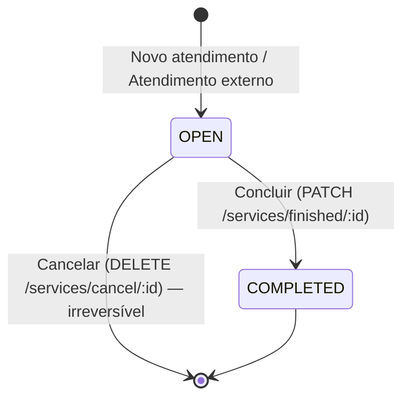

# Domínio e regras de negócio

O LexHub ("OAB Atende") registra os atendimentos prestados por
funcionários(as) da OAB Seccional do Maranhão a advogados(as) inscritos(as).

## Glossário

| Termo (UI) | Código / API | Descrição |
| --- | --- | --- |
| Atendimento | `service` | Registro de um atendimento a um(a) advogado(a). Tem 1..N tipos de serviço. |
| Advogado(a) | `lawyer` | Pessoa atendida, identificada pelo número de inscrição OAB. Dados vêm da consulta ao backend. |
| Funcionário(a) | `agent` | Usuário do sistema que registra os atendimentos. |
| Tipo de Serviço / Serviço | `service type` | Categoria do atendimento (ex.: emissão de certidão). Catálogo mantido por administradores. |
| Forma do atendimento | `assistance` | `PERSONALLY` = Presencial · `REMOTE` = Remoto |
| Status | `status` | `OPEN` = Em andamento · `COMPLETED` = Concluído/Encerrado |
| Cargo | `role` | `ADMIN` = Administrador · `MEMBER` = Membro |
| Situação | `inactive` | `null` = Ativo · data = Inativo desde a data |
| Atendimento externo | `POST /services/external` | Advogado(a) informado manualmente (OAB, nome, e-mail), sem a consulta prévia. |

## Ciclo de vida do atendimento

- Um atendimento nasce `OPEN` com o funcionário logado como responsável.
- **Concluir** grava `finishedAt`; a duração é `finishedAt − createdAt`
  (mínimo exibido: 1 min).
- **Cancelar** remove o atendimento (verbo `DELETE`); não existe estado
  "cancelado".
- Atendimentos `COMPLETED` não podem ser concluídos nem cancelados.

## Registro de atendimento

1. **Consulta pela OAB** (`POST /services/consult/lawyer`). O backend decide
   se o(a) advogado(a) pode ser atendido(a) — em caso negativo (inexistente,
   inadimplente etc.) retorna erro com `message`, exibido em alerta.
2. Com a consulta aprovada: forma do atendimento, ≥ 1 tipo de serviço e
   observação opcional.
3. Alternativa: **Atendimento externo** quando não se usa a consulta —
   OAB, nome e e-mail são digitados.

## Permissões

| Funcionalidade | MEMBER | ADMIN |
| --- | :-: | :-: |
| Login, recuperação de senha | ✅ | ✅ |
| Dashboard (`/dashboard`) | ✅ | ✅ |
| Listar/filtrar/ver detalhes de atendimentos (`/services`) | ✅ (todos os atendimentos) | ✅ |
| Registrar atendimento / atendimento externo | ✅ | ✅ |
| Concluir / cancelar **o próprio** atendimento | ✅ | ✅ |
| Concluir / cancelar atendimento **de outro** funcionário | ❌ | ✅ |
| Controle de Serviços (`/services-types`) | ❌ | ✅ |
| Gestão de Funcionários (`/agents`) | ❌ | ✅ |

Onde é aplicado no frontend:
- Rotas: `src/middleware.ts` (`adminRoutes`).
- Menu: `AppSidebar` recebe `hasPrivilegedAccess` de `checkAdminStatus()` e
  exibe o grupo "Administração" (definido em `nav-config.ts`) só para ADMIN.
- Botões de concluir/cancelar: `service-table-row.tsx`
  (`agent.id === sub` ou `isAgentAdmin`).

## Funcionários

- Cadastro com senha provisória (padrão pré-preenchido no formulário); o
  backend envia as credenciais por e-mail.
- Não há exclusão: o acesso é **revogado** (`inactive` recebe a data) e pode
  ser **restaurado**.
- Funcionário inativo não pode ser editado até ser reativado.
- Troca de senha pelo próprio usuário só existe via fluxo "Esqueceu a
  senha?" (código por e-mail).

## Tipos de serviço

- Apenas criação e renomeação; não há exclusão nem desativação.
- Identificador em formato cuid, exibido e copiável na listagem.
